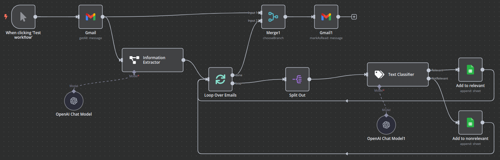

# AI-Powered Google Scholar Alerts Automation with n8n

📚 **Stay on top of your research without drowning in unread papers!**

Ever found yourself flooded with hundreds or even thousands of unread Google Scholar alerts emails, making it hard to keep up-to-date and efficiently track relevant papers for your research? You're not alone. We've faced exactly the same struggle—with over 1800 unread emails piling up—while urgently needing to update the related work chapter.

Fortunately, we automated and optimized this workflow using [n8n.io](https://n8n.io/).

## 🚀 How it works

This automation workflow significantly reduces manual reading workload by automatically classifying incoming paper alerts as either relevant or non-relevant, helping you focus only on the papers that truly matter.

*Overview of the automated Google Scholar alerts processing workflow*

Here's how the automation workflow functions step-by-step:

1. **Manually trigger the workflow** whenever you want.
2. **Fetch the unread Google Scholar alert emails** (e.g., the most recent 100 from "scholaralerts-noreply").
3. **Extract the paper details** (title, snippet, URL)—note that an email may contain multiple papers.
4. **Classify each paper** automatically into "Relevant" and "Non-Relevant".
5. **Save relevant papers** directly into a Google Sheet (paper URL + title).
6. Automatically **mark all processed alert emails as read**.
7. **Repeat** until you've processed all unread alerts.

## ⚙️ Setup  

To use and improve this automation workflow for your own research, follow the instructions below:

1. Clone this repository to your local machine.
2. Grab the `GoogleScholar_Alerts_Automation.json` file, create a new n8n workflow, and click on the "Import from File" option.
3. Set up the GMail and Google Sheets auth (you may also use different data sources) in the [Google Cloud Console](https://console.cloud.google.com/).
   * Note: If you haven't used the GMail and Google Sheets APIs before, you need to *enable* them in the Google Console.
4. Set up your OpenAI API key in the corresponding component.
5. Run the automation workflow either manually or schedule it according to your preference.

---

👏 If this project helps you save time and effort, please consider giving it a ⭐️!

## 📌 Contributing  

You're welcome to improve this setup and collaborate by providing bug reports, feature requests, or pull requests. Let's make research easier and more efficient for everyone!

---

🎓 **Happy Researching!**
